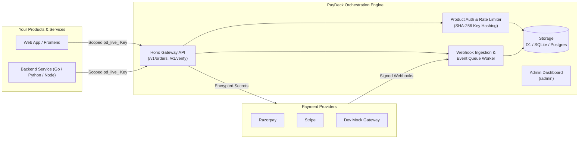

<div align="center">

# 💳 PayDeck

### *Zero-Trust, Multi-Tenant Payment & Subscription Orchestration Engine*

[](LICENSE)
[](https://www.typescriptlang.org/)
[](https://hono.dev)
[](https://workers.cloudflare.com/)
[](https://bun.sh)
[](https://nodejs.org/)
[](sdks/go/paydeck)
[](sdks/python)
[](https://pypi.org/project/paydeck/)

<p align="center">
  <b>A unified, edge-ready payment microservice that insulates your products from gateway complexities.</b><br>
  Products authenticate with scoped API keys — gateway secrets never touch client apps or frontends.
</p>

[Quick Start](#-quick-start) • [Architecture](#-architecture) • [Features](#-key-features) • [SDKs](#-sdks) • [API Reference](#-api-map) • [Deployment](#-deployment)

---

</div>

## 🚀 Key Features

- **🛡️ Zero-Trust Security Boundary**: Products only hold hashed scoped keys (`pd_live_` / `pd_test_`). Razorpay and Stripe API keys & webhook secrets remain completely isolated within PayDeck.
- **⚡ Multi-Gateway Orchestration**: First-class support for **Razorpay** and **Stripe**, plus a zero-dependency **Dev Mock Engine** (`ALLOW_DEV_CHARGE=1`) for local offline development.
- **🔄 Subscriptions & Multi-Currency**: Define plans across global currencies (`INR`, `USD`, `EUR`, etc.), handle recurring billing, plan intervals, and automated refunds.
- **📬 Durable Webhook Queue & Dispatcher**: Robust webhook ingestion with HMAC signature verification, background retry queues, and worker dispatchers to downstream consumers.
- **🌐 Deploy Anywhere**:
  - **Edge**: Cloudflare Workers + Cloudflare D1
  - **Containers**: Node.js or Bun + SQLite (`better-sqlite3`) or PostgreSQL
- **🏢 Multi-Tenant Cloud Architecture**: Supports isolated tenant scopes, custom rate limits per product tier, audit trails, and data retention pruning.
- **🖥️ Embedded Admin UI**: Built-in dashboard (`/admin`) to inspect transactions, configure products, generate API keys, and monitor webhook delivery.
- **📦 Multi-Language SDKs**: Official production-ready SDKs for **TypeScript**, **Go**, and **Python**.

---

## 🏗️ Architecture



---

## ⚡ Quick Start

### 1. One-Click Service Management

PayDeck includes turnkey orchestration scripts for local and production daemon management:

| Command | Description |
|---|---|
| `./start_all.sh` | Starts PayDeck in the background, waits for readiness probe, and reports URLs |
| `./status.sh` | Probes service health, listeners, endpoints, DB size, and recent logs |
| `./scripts/logs.sh` | Streams live unified application logs (`tail -f logs/paydeck.log`) |
| `./restart_all.sh` | Performs a clean process termination and cold restart |
| `./scripts/smoke-test.sh` | Executes 58 automated end-to-end curl checks across all API surfaces |
| `./stop_all.sh` | Gracefully shuts down background instances and frees allocated ports |

```bash
# Clone & start
git clone http://github.com/pisigmac/PayDeck.git
cd PayDeck
npm install

# Start PayDeck services
./start_all.sh

# Verify health status
./status.sh
```

---

### 2. Manual Development Setup

#### Using Node.js or Bun
```bash
# Configure local environment
cp .env.example .dev.vars

# Apply migrations
npm run db:local

# Start server with Bun or Node
npm run start:bun
# or: npm start
```

#### Using Cloudflare Wrangler
```bash
npm run dev
# Server listening at http://127.0.0.1:8787
```

---

## 🛠️ Usage & Integration

### Bootstrap Product & Plan (Admin)

```bash
export BILLING="http://127.0.0.1:8787"
export ADMIN="your-billing-admin-token"

# 1. Register a product
curl -s -X POST "$BILLING/v1/admin/products" \
  -H "X-Admin-Token: $ADMIN" \
  -H "Content-Type: application/json" \
  -d '{
    "slug": "saas-app",
    "name": "My SaaS App",
    "rate_limit_per_hour": 1000
  }'

# 2. Issue an API Key (store key securely)
curl -s -X POST "$BILLING/v1/admin/products/saas-app/keys" \
  -H "X-Admin-Token: $ADMIN" \
  -H "Content-Type: application/json" \
  -d '{"name": "Production Key", "environment": "live"}'
# → { "key": "pd_live_abc123...", "prefix": "pd_live_ab" }

# 3. Create a billing plan
curl -s -X POST "$BILLING/v1/admin/products/saas-app/plans" \
  -H "X-Admin-Token: $ADMIN" \
  -H "Content-Type: application/json" \
  -d '{
    "slug": "pro-monthly",
    "name": "Pro Monthly",
    "amount_paise": 49900,
    "currency": "INR",
    "interval": "month"
  }'
```

### Create Order & Verify (Client)

```bash
# Create an order with idempotency guarantee
curl -s -X POST "$BILLING/v1/orders" \
  -H "Authorization: Bearer pd_live_abc123..." \
  -H "Idempotency-Key: checkout_req_89210" \
  -H "Content-Type: application/json" \
  -d '{"plan": "pro-monthly"}'
# → { "order_id": "order_...", "amount": 49900, "currency": "INR", "key_id": "rzp_..." }

# Verify payment signature upon checkout completion
curl -s -X POST "$BILLING/v1/verify" \
  -H "Authorization: Bearer pd_live_abc123..." \
  -H "Content-Type: application/json" \
  -d '{
    "razorpay_order_id": "order_...",
    "razorpay_payment_id": "pay_...",
    "razorpay_signature": "e4d3c2..."
  }'
```

> [!TIP]
> **Dev Mode**: When `ALLOW_DEV_CHARGE=1` is set without provider credentials, PayDeck automatically generates synthetic successful payments (`mode: "dev"`), making local offline development effortless.

---

## 📦 SDKs

PayDeck provides first-party SDKs across ecosystems:

### TypeScript / Node.js
```ts
import { PayDeckClient } from 'paydeck' // or ./src/client

const paydeck = new PayDeckClient({
  baseUrl: process.env.PAYDECK_URL,
  apiKey: process.env.PAYDECK_API_KEY, // pd_live_...
})

// Create order
const order = await paydeck.createOrder({
  plan: 'pro-monthly',
  idempotencyKey: `usr_${userId}_sub`,
})

// Verify signature
const result = await paydeck.verify({
  razorpay_order_id: order.data.order_id,
  razorpay_payment_id: paymentId,
  razorpay_signature: signature,
})
```

### Go
```go
import "github.com/pisigmac/PayDeck/sdks/go/paydeck"

client := paydeck.NewClient("https://billing.yourdomain.com", "pd_live_...")
order, err := client.CreateOrder(context.Background(), paydeck.CreateOrderRequest{
    Plan:           "pro-monthly",
    IdempotencyKey: "order_12345",
})
```

### Python
```bash
pip install paydeck
```

```python
from paydeck import PayDeckClient

client = PayDeckClient(base_url="https://billing.yourdomain.com", api_key="pd_live_...")
order = client.create_order(plan="pro-monthly", idempotency_key="order_12345")
client.verify_payment(order_id=order["order_id"], payment_id=pay_id, signature=sig)
```

---

## 🗺️ API Reference

| Endpoint | Method | Auth | Description |
|---|:---:|---|---|
| `/health` | `GET` | Public | System status, runtime info, and DB connectivity probe |
| `/v1/openapi.json` | `GET` | Public | OpenAPI 3.0 specification |
| `/v1/plans` | `GET` | Product Key | Retrieve all active plans for the authenticated product |
| `/v1/orders` | `POST` | Product Key | Create a checkout order (`Idempotency-Key` supported) |
| `/v1/verify` | `POST` | Product Key | Cryptographic HMAC payment verification |
| `/v1/payments` | `GET` | Product Key | List payment transactions with pagination & status filters |
| `/v1/payments/:id` | `GET` | Product Key | Fetch single payment record details |
| `/v1/subscriptions` | `POST` | Product Key | Create or manage recurring subscriptions |
| `/v1/refunds` | `POST` | Product Key | Initiate full or partial refund for a captured payment |
| `/v1/webhooks/razorpay` | `POST` | Provider Sig | Webhook ingestion endpoint for Razorpay events |
| `/v1/webhooks/stripe` | `POST` | Provider Sig | Webhook ingestion endpoint for Stripe events |
| `/v1/admin/*` | `*` | Admin Token | Manage products, API keys, plans, audits, & queues |
| `/admin` | `GET` | Admin Token | Interactive Admin Dashboard |

---

## 🔒 Security Architecture

- **Hashed API Keys**: Keys use format `pd_{env}_{entropy}`. Only cryptographic SHA-256 hashes and short prefixes are persisted.
- **HMAC Verification**: Signatures are checked using constant-time cryptographic comparisons against raw payloads.
- **Scoped RBAC**: Client products cannot access admin endpoints, cross-tenant records, or modify billing plans.
- **Rate-Limiting**: Token bucket rate limits enforced on all endpoints per product and IP.
- **Tamper-Evident Audit Logs**: All state-modifying actions produce audit logs with request IDs, caller identity, and action metadata.

---

## 🚢 Deployment

### Deploy to Cloudflare Workers & D1
```bash
# 1. Provision D1 Database
npx wrangler d1 create paydeck
# Copy the returned database_id into wrangler.toml

# 2. Run remote schema migrations
npx wrangler d1 migrations apply paydeck --remote

# 3. Store production secrets
npx wrangler secret put BILLING_ADMIN_TOKEN
npx wrangler secret put RAZORPAY_KEY_ID
npx wrangler secret put RAZORPAY_KEY_SECRET
npx wrangler secret put RAZORPAY_WEBHOOK_SECRET

# 4. Deploy to the Edge
npx wrangler deploy
```

### Deploy with Docker & Docker Compose
```bash
docker-compose up -d --build
```

---

## 📄 License

Distributed under the [MIT License](LICENSE).  
Copyright © 2026 [codecraker (Vikas Budde)](https://github.com/codecraker) / PiSigma.
